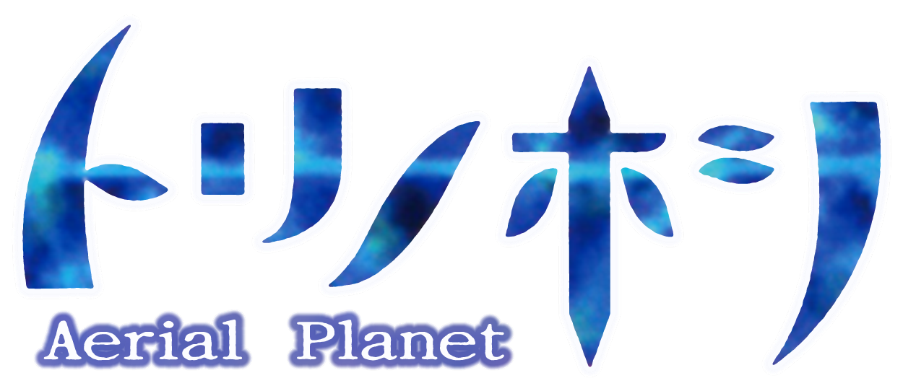

<p align="center">
  
</p>

Фанатский перевод **Tori no Hoshi ~Aerial Planet~** (トリノホシ ～Aerial Planet～, PS2) на русский язык.

Версия **1.11** от 18.06.2026.

> Здесь только патч-русификатор. Образ игры не распространяется: нужен собственный дамп японской версии игры.

## Содержание

- [Что уже переведено](#что-уже-переведено)
- [Что ещё нужно перевести](#что-ещё-нужно-перевести)
- [Как установить русификатор](#как-установить-русификатор)
- [Проверка результата](#проверка-результата)

## Что уже переведено

Весь сюжет (11 126 реплик во всех главах), все меню (лагерь, провизия, задания, атлас и режим «Слова»,
список птиц, сохранения, полёт, редактор имён, проверка карты памяти), подсказки кнопок в меню и в полёте,
а также надписи на текстурах: текст заставки, кнопки титульного экрана, карточки заданий,
«Задание выполнено!!», причины GAME OVER, «Год спустя», заголовок базы, новостная строка о «Пеликане».

Шрифт игры дополнен кириллицей. Озвучка остаётся японской.

## Что ещё нужно перевести

- Латинские заголовки интерфейса (STAGE NAME, QUEST, MEMO, SLOT, VOICE MEMO, VIDEO MAIL и т. п.).
- Часть японских надписей на картинках внутри сцен.
- Финальные титры.

## Как установить русификатор

### 1. Оригинальный образ

Японская версия игры (SLPS-25812): `Tori no Hoshi - Aerial Planet (Japan).iso`

| Параметр | Значение |
| --- | --- |
| Размер | 4 318 199 808 байт |
| CRC32 | `74355A5E` |
| MD5 | `A6CAF57835F1F8656E1E484A8D951FDA` |
| SHA-1 | `29B203CE2CFF69729325097D3CC7CA83281A5BAC` |

> Патч подходит только к образу с этими контрольными суммами. Если они не совпадают, патч не применится или игра будет работать некорректно.

### 2. Программа для xdelta-патчей

- GUI - **xdelta UI** или **Delta Patcher**;
- CLI - [**xdelta3**](https://github.com/jmacd/xdelta-gpl/releases).

### 3. Применение патча

#### GUI (xdelta UI / Delta Patcher)

1. Укажите исходный файл: `Tori no Hoshi - Aerial Planet (Japan).iso`
2. Укажите патч-русификатор: `Tori no Hoshi - Aerial Planet [JPN-RUS, v1.11].xdelta`
3. Сохраните новый образ как `Tori no Hoshi - Aerial Planet [RUS, v1.11].iso`
4. Нажмите **Применить** (Apply / Patch)

#### CLI (xdelta3)

```
xdelta3 -d -s "Tori no Hoshi - Aerial Planet (Japan).iso" "Tori no Hoshi - Aerial Planet [JPN-RUS, v1.11].xdelta" "Tori no Hoshi - Aerial Planet [RUS, v1.11].iso"
```

> Оригинальный образ не изменяется: создаётся новый файл образа с русификатором.

## Проверка результата

Готовый образ: `Tori no Hoshi - Aerial Planet [RUS, v1.11].iso`

| Параметр | Значение |
| --- | --- |
| Размер | 4 318 199 808 байт (как у оригинала) |
| CRC32 | `6CB35600` |
| MD5 | `FD622CDB301E1E630A95C0BADE764D09` |
| SHA-1 | `F01590A0861F6272A6E64DB08234AA0F9CCF64BC` |
